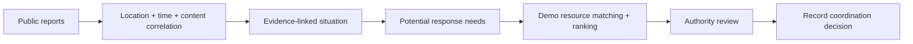

# RESQ360

### From a distress signal or scattered public reports to a clearer response picture

RESQ360 is an **Android emergency-response prototype** built with React Native/Expo and a Node.js backend. It has two distinct workflows:

1. **Personal SOS:** a person asks saved contacts and nearby registered app users for help; a responder can navigate to the sender's live location and request GPS-based arrival verification.
2. **Public emergency decision support:** people submit observations; RESQ360 groups related reports into an evidence-linked situation, identifies potential response needs, and ranks nearby **fictional demo resources** for an authority to review.

The app does **not** connect to government emergency systems, confirm casualties, or automatically dispatch agencies. It is a hackathon prototype, **not a replacement for official emergency services**.


> **Concept illustration:** the diagram includes proposed future integrations such as telecom cell broadcasts, government agency data exchange, photo/video reporting, a trained AI engine, and an analytics dashboard. These are **not** implemented in the current prototype. Current resources are fictional demo records; routing and situation assessment work without a trained model; coordination records a decision but does not dispatch an agency.

## The problem and the idea

During an emergency, useful information can arrive as separate messages: “landslide near the road,” “people may be trapped,” and “the road is blocked.” Treating each message as an unrelated incident makes it harder to form a timely picture. RESQ360 links nearby, recent, content-related reports while preserving the original evidence and its uncertainty. An authorized reviewer sees the situation **before** choosing any response resource.



The personal SOS workflow is separate:

```text
SOS → contacts + nearby app users → I'M COMING → live map
    → I REACHED → server-side GPS verification → NEED MORE HELP
```

## End-to-end workflow — implemented prototype

The two paths below share the Android app, map, and Node.js backend, but **a public report never starts a personal SOS**, and an authority coordination record never dispatches a real agency.

### A. Public emergency: report → situation → authority decision

1. **A person submits an observation.** From **Home → Report Public Emergency**, they choose an incident type and severity, enter a description, and submit their current GPS location. For a lab demo, they can explicitly choose nearby, simulated Coimbatore coordinates instead. This action makes **no contact call, SMS, or automatic agency alert**.
2. **The backend validates and stores the report.** `POST /public-incidents` checks the type and coordinates, records the report and timestamp in `public-incidents.json`, and returns a report ID. An identical report from the same demo/real mode and almost the same coordinates within 10 seconds returns the existing report instead of inflating the count.
3. **Situation Intelligence checks whether it belongs to an existing event.** The server compares incident type, demo/real mode, description signals, Haversine distance, and report time. The defaults are **within 1 km and 30 minutes**, with at least a shared content anchor/condition except for very close sparse reports. A related report gets the existing `situationId`; an unrelated one starts a separate situation.
4. **The situation picture is rebuilt from its source reports.** The backend calculates a representative center, report count, first/last report times, condition labels (**REPORTED** versus **POSSIBLE**), explainable severity reasons, a summary, and **INFERRED** potential response needs. The original report locations and descriptions remain inspectable. If optional AI is absent, unavailable, or invalid, the assessment is explicitly **RULE_BASED**; factual locations, distances, IDs, and stored state stay backend-controlled.
5. **The existing resource matcher ranks demo units.** Using the situation center and response needs, it checks the fictional registry's capabilities, distance, and stated availability within the configured search radius. It does not invent a resource when none match; no agency is contacted.
6. **An authority reviews the evidence.** In **Authority resource view**, the reviewer enters the server's `RESQ_AUTHORITY_KEY`, selects a situation, and sees the summary, uncertainty labels, severity reasons, original reports, ranked resources, and existing map with the situation center and report points. Without a valid key, these views fail closed. The screen refreshes while open, so later reports can change the picture.
7. **An authority records a choice.** **COORDINATE RESPONSE** is offered for an available matching demo unit. After confirmation, the backend stores a coordination action against the public incident. The visible result is a decision record—not a call, dispatch, government command, or confirmed response.

**Failure paths:** invalid coordinates are rejected; distant, old, or incompatible reports stay separate; a missing authority key blocks review; an empty resource search remains empty; and optional AI failures fall back to rules rather than inventing an answer.

### B. Personal emergency: SOS → nearby responder → verified arrival

1. **Prepare the phones.** The sender saves emergency contacts and a normal **I'm Safe** passkey in Settings. A different duress passkey and consent-based evidence recording are optional. A responder needs a separate registered installation, location permission, and working push/network access. Use only test numbers for demonstrations.
2. **The sender starts SOS.** Tapping the Home **SOS** button opens the emergency screen, vibrates, and logs a local event. The app attempts a call to the **first** saved contact and sends an SOS SMS with a map link to saved contacts. If the call ends or fails, the sender may be offered the **next** contact; it does not call every contact simultaneously. A supported incoming SOS-format SMS is another trigger path.
3. **The backend broadcasts nearby.** With valid GPS and a registered push token, the app sends the SOS to the backend. The server records it and targets other registered installations whose **last stored** locations are inside the initial **1 km** radius; the sender's own installation is excluded. If the SOS screen remains active, escalation attempts expand to **3 km after 20 seconds** and **10 km after 60 seconds**. Push delivery still depends on the OS, network, and Expo/FCM.
4. **The sender's situation remains active.** The app sends location updates while its tracking service is running. If evidence consent and microphone permission are present, it records roughly 10-second audio parts and a location timeline while the SOS remains active; server backup depends on connectivity. The sender sees delivery and responder counts on the emergency screen.
5. **A receiver chooses to respond.** A community-alert screen shows the sender and available location/evidence links. **I'M COMING** records that this responder is participating and opens the existing map. The map shows current sender/reacher markers and recalculates an available driving route, distance, and ETA as positions change. Routing uses public OSRM alternatives and a **70% ETA / 30% distance** rule; it has no verified road-safety feed.
6. **Arrival is checked by the backend.** **I REACHED** sends a fresh responder location update and asks the server to verify. The server confirms responder participation and an unresolved alert, then compares the latest sender and responder GPS using Haversine, timestamps, accuracy, and the configured arrival threshold (default **150 m**, with GPS uncertainty included). An early, stale, inaccurate, or out-of-range attempt is **not verified**; the responder can continue navigation and retry.
7. **Only a verified responder can escalate.** After successful arrival verification, **NEED MORE HELP** becomes available. The server checks the stored verification again and can notify other registered app responders. A frontend button state alone cannot unlock this action.
8. **The sender ends—or discreetly hides—the SOS.** With the normal passkey, **I'm Safe** asks the backend to resolve the alert, notifies responders, stops the local call/evidence activity, and closes the sender's alert. If that server request fails, the SOS is not falsely marked resolved. The **duress passkey** instead hides the alert on the sender's screen without sending an “I'm safe” resolution; help remains active.

**Failure paths:** missing GPS or permission prevents reliable location actions; poor or stale GPS cannot verify arrival; a non-participating responder cannot verify or request more help; and an unresolved network request must not be presented as a successful resolution. This prototype does **not** guarantee delivery while an app is force-stopped or a phone is powered off.

### C. Concept-only extension shown in the architecture image

The illustration also depicts verified agency feeds, a trained AI engine, official authority decisions, and geo-targeted telecom/cell broadcasts to the affected public. Those would require agency agreements, validated data, regulatory approval, stronger authentication, and reliable infrastructure. **They are future integration ideas, not an executable path in this repository or the hackathon demo.**

## What the prototype does

| Area | Implemented behavior |
|---|---|
| Personal SOS | One-tap SOS; attempts a call to the **first** saved contact, sends SMS to saved contacts, and broadcasts to registered app users whose last stored locations fall inside the configured alert radius. The sender is excluded from their own community push. |
| Responder workflow | “I'M COMING” acknowledges an alert. The existing map shows sender/reacher positions and a route with distance and ETA. “I REACHED” requests backend verification against recent, sufficiently accurate GPS; “NEED MORE HELP” is blocked until verification succeeds. |
| Safe / duress codes | The sender's normal passkey resolves the SOS and notifies responders. A separate duress passkey hides the alert locally without announcing that the sender is safe. |
| Evidence | With user consent, the SOS screen records audio in approximately 10-second parts while active and maintains a location timeline; backup depends on server connectivity. Evidence deletion requires a passkey. |
| Public reporting | Incident type, severity, description, and current GPS can be submitted without triggering personal SOS. An explicitly marked Coimbatore demo-location option supports lab presentations. |
| Situation Intelligence | The backend correlates reports by incident type, content, Haversine distance, and time. It keeps each report, derives a changing center and summary, labels conditions **REPORTED** or **POSSIBLE**, explains severity, and labels response needs **INFERRED**. |
| Resource identification | The same backend ranks the registered **demo** units by distance, capability match, situation needs, and stated demo availability. The authority can inspect source reports and map points, then record a coordination decision. |

The map uses OpenStreetMap tiles and a public OSRM routing endpoint. Its route recommendation is a transparent **70% ETA / 30% distance rule**, not a trained safety-prediction model or a guarantee that a road is safe.

## 2-minute hackathon demo

This is the safest presentation path because it does not call or text a real emergency contact.

1. Start with the backend deployed and set a long random `RESQ_AUTHORITY_KEY` in its environment. Do **not** put the key in Git or slides.
2. In the Android app, open **Home → Report Public Emergency**. Select **LANDSLIDE**, **HIGH**, and **Use Coimbatore demo location**.
3. Submit **“Large landslide has blocked the road.”**
4. Tap **Report Another Observation** and submit **“People may be trapped near the blocked road.”**
5. Submit a third observation: **“Road is completely blocked by mud.”**
6. Open **Authority resource view**, enter the configured key, and select the landslide situation. Show **3 related reports**, the original descriptions, the **REPORTED** road blockage, **POSSIBLE** trapped people, and inferred needs such as search and rescue and medical support.
7. Tap **View Reports** and **View on Existing Map**. Show the situation center, report locations, and ranked demo units. Choose an available unit and tap **Coordinate Response**. Explain that this **records a decision only**—it does not contact the unit.

For a separate personal-SOS demonstration, use **two test phones and test contacts**. Pressing SOS can place a real call and send real SMS. On the responder phone, demonstrate “I'M COMING,” live navigation, an early failed “I REACHED,” and a successful verification only when close enough. End the sender's test alert using the normal safety passkey.

The [hackathon presentation](RESQ360_Final_Hackathon_Presentation.pptx) is included in this repository. The APK is **not** committed; share it separately if your submission requires an installable build.

## How Situation Intelligence works

- Each public report remains an individual record in the existing `public-incidents.json` store. A `situationId` links related reports; the situation view is derived from those reports rather than maintaining a second independent incident database.
- A new report can join a cluster when it has a compatible incident type and demo/real mode, is geographically and temporally close to a member, and shares a content anchor or condition. Defaults: **1 km** and **30 minutes**, configurable by environment variables. An identical submission within 10 seconds is deduplicated.
- The backend—not an AI model—computes distances, timestamps, report IDs, a representative center, and resource availability. The summary, severity reasons, conditions, and potential needs have a deterministic rule-based path.
- “People may be trapped” stays **POSSIBLE**; it is not converted into a confirmed casualty claim. “REPORTED” means a user reported a condition, **not** that RESQ360 independently verified it. Confidence labels are heuristics, not calibrated probabilities or official disaster classifications.
- An optional HTTPS AI service can return a structured assessment. The server validates it against known report IDs, allowed values, and extracted evidence; invalid output falls back to **RULE_BASED**. **No pretrained or trained AI model is bundled or required.**
- New reports update the situation picture. The authority screen refreshes periodically while open; resource ranking uses the current situation center and inferred needs.

## Architecture

```text
Android app (React Native / Expo)
├─ Home, Contacts, History, Settings
├─ Personal SOS, community alert, shared Map screen
└─ Public report and authority resource screens
       │ HTTP / Expo push
       ▼
Node.js server (server/alert-broadcast-server.js)
├─ SOS broadcast, live location, evidence and arrival verification
├─ Public reports → situation-intelligence.js
└─ Situation needs → resource-matching.js → demo-resources.json
       │
       ▼
JSON files in SAFEGUARD_DATA_DIR (prototype storage)
```

Key source files:

| Path | Responsibility |
|---|---|
| `src/navigation/AppNavigator.js` | Existing tabs and screens |
| `src/screens/HomeScreen.js` | Personal SOS and public-emergency entry points |
| `src/screens/MapScreen.js` | Existing map, responder route, situation/report/resource markers |
| `src/screens/PublicEmergencyScreen.js` | Public report form and demo location |
| `src/screens/AuthorityResourcesScreen.js` | Evidence-linked situation and authority decisions |
| `src/services/CommunityAlertService.js` | App-to-backend calls and push registration |
| `server/alert-broadcast-server.js` | HTTP API, authority-key check, prototype persistence |
| `server/situation-intelligence.js` | Correlation and rule-based situation assessment |
| `server/resource-matching.js` | Capability, availability, distance, and need-aware ranking |
| `server/reacher-verification.js` | Haversine calculation and arrival checks |

## Run it locally

### Requirements

- Node.js **18+** and npm
- Android Studio/SDK, an Android device or emulator, and **JDK 17** for a local native build
- A Firebase project configured for Android push notifications; keep `google-services.json` private
- Internet access for cloud alerts, map tiles, and route requests

```powershell
git clone https://github.com/kamaleshjk102007-dot/RESQ-360.git
cd RESQ-360
npm ci
```

Place your own Firebase `google-services.json` at the repository root. For a direct Gradle build using the checked-in `android/` project, also place a copy at `android/app/google-services.json`. Both paths are Git-ignored. Never commit credentials or production secrets.

For a **local backend** in PowerShell:

```powershell
$env:RESQ_AUTHORITY_KEY = "replace-with-a-long-random-private-value"
npm run alerts:server
```

The backend defaults to port **10000**; `GET /health` is a basic readiness check. The current Android app is configured in `src/config.js` to use `https://safe-alerts.onrender.com`. Running a local backend alone does **not** redirect the installed app: change that constant for a local test build, use your computer's reachable LAN address, and rebuild the app. The server URL is deliberately not editable in Settings.

For a development build (Metro must be running when using a debug build):

```powershell
npm run android
```

For the current local release APK:

```powershell
cd android
.\gradlew.bat assembleRelease
```

The result is `android/app/build/outputs/apk/release/app-release.apk`. **This project currently signs its “release” build with the Android debug key**; use it for testing, not Play Store distribution. Configure a private production signing key before any real release. The Expo/EAS owner in `app.json` is a placeholder and must be changed before using EAS under your account.

### Backend configuration

Set environment variables in your terminal or deployment platform; the Node server does not automatically load a `.env` file.

| Variable | Purpose / default |
|---|---|
| `PORT` | HTTP port; default `10000` |
| `SAFEGUARD_DATA_DIR` | Directory for prototype JSON records; default `server/` |
| `RESQ_AUTHORITY_KEY` | Required for authority-only public-incident and situation APIs; without it, access fails closed |
| `SAFEGUARD_ALERT_API_KEY` | Optional shared key for applicable SOS endpoints; unset by default. Clients must be configured with the same key before enabling it. |
| `SAFEGUARD_ALERT_RADIUS_KM` | Initial nearby community-alert radius; default `1` km |
| `RESOURCE_SEARCH_RADIUS_KM` | Demo resource search radius; default `10` km |
| `SITUATION_CORRELATION_RADIUS_KM` | Report correlation radius; default `1` km |
| `SITUATION_CORRELATION_WINDOW_MINUTES` | Report correlation window; default `30` minutes |
| `REACHER_ARRIVAL_RADIUS_METERS` | Server-side arrival threshold; default `150` m |
| `REACHER_LOCATION_MAX_AGE_SECONDS` | Maximum age of GPS used for verification; default `60` seconds |
| `REACHER_MAX_GPS_ACCURACY_METERS` | Maximum accepted reported GPS accuracy; default `50` m |
| `SITUATION_AI_URL`, `SITUATION_AI_API_KEY`, `SITUATION_AI_TIMEOUT_MS` | Optional HTTPS structured-assessment service; default timeout `3000` ms |
| `RESQ_RESOURCE_AI_URL`, `RESQ_RESOURCE_AI_API_KEY` | Optional HTTPS resource suggestion service |

The authority screen sends `RESQ_AUTHORITY_KEY` as `X-RESQ-Authority-Key`. Do not add the key to source code, the APK, screenshots, or the README.

### Selected API routes

| Route | Purpose | Access |
|---|---|---|
| `GET /health` | Backend readiness | Public |
| `POST /public-incidents` | Submit a public report | Public prototype endpoint |
| `GET /public-situations` | List derived situations | Authority key |
| `GET /public-situations/:id` | Situation and source reports | Authority key |
| `GET /public-incidents/:id/situation` | Situation for a report | Authority key |
| `GET /public-incidents/:id/nearby-resources` | Ranked demo resources and situation | Authority key |
| `POST /public-incidents/:id/coordinate` | Record a coordination action | Authority key |
| `POST /broadcast-sos`, `POST /verify-arrival`, `POST /request-more-help` | Personal SOS / responder workflow | Existing SOS checks |

## Verification

Run the complete backend test suite from the repository root:

```powershell
node --test server/*.test.js
```

At the last verified run, **31/31 backend tests passed**. They cover public reporting, situation clustering and evidence labels, AI-output constraints and fallback, resource ranking, authority access, SOS integration, GPS accuracy/staleness, arrival verification, and protected “Need More Help.” The Android JavaScript bundle and local release APK also built successfully for v1.0.2. This is test evidence for the prototype, **not** a guarantee of emergency reliability.


## Limitations and responsible use

- **No official integration:** the five resource records in `server/demo-resources.json` are fictional. Availability is static demo data, not a government or hospital feed. “Coordinate Response” does not place a call, send a message, or dispatch anyone.
- **No deployed AI model by default:** situation extraction, severity, routing score, and resource ranking are explainable rules unless separate optional AI services are configured. Do not describe this build as having a trained disaster-prediction model.
- **Prototype storage and access control:** JSON files and a shared authority key are suitable for a controlled demo, not multi-tenant production. Render's default filesystem may be ephemeral; use a durable database, stronger identity/authorization, auditing, and abuse protection before real-world use. The public report endpoint is not identity-verified.
- **GPS and network limitations:** mobile GPS can be stale, inaccurate, unavailable, or spoofed. Community targeting uses each device's last stored location, which may itself be stale. Arrival verification checks age and accuracy but cannot prove a person physically reached someone. Push delivery, background execution, mobile data, third-party maps/routing, and the phone battery can fail. A phone that is powered off cannot run the app.
- **Safety and privacy:** SOS tests may make **real calls and SMS**. Use test contacts and obtain consent. Public reports and evidence can contain sensitive descriptions, locations, and audio; avoid real personal data in demos and define retention/access policies before production.

For an actual emergency, contact the appropriate official emergency service directly. **Do not rely on RESQ360 as your sole means of getting help.**


## Future work

Replace the demo registry with verified, consent-based resource data; add durable storage and stronger authority identity; evaluate clustering on annotated local-language reports; and validate routing and notification behavior in controlled field tests. Until then, RESQ360 remains a transparent decision-support prototype, not a production emergency service.
